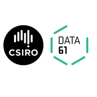

# Reflex Realworld Workshop

This workshop is a step by step walkthrough of how to implement the [Real World Demo App](https://github.com/gothinkster/realworld/tree/master/api) spec in Obelisk/Reflex. The full implementation is available in the submodule sitting in reflex-realworld-example if you want to see the finished product or peek at it for answers. :)

This is being presented at YOW Lambda Jam 2019, but I hope that this continues as a living resource and example after the conference, so if it becomes out of date with the latest Obelisk, please file an issue or PR!

## Keeping in Touch / Getting assistance

When I release new changes to the workshop, I will release them as github releases. If you are doing the workshop at Lambda Jam, I highly recommend watching this repo for releases so I can let you know to pull new code if necessary.

If you have any issues or questions with the material, please feel free to reach out via a github issue, the gitter room or #QFPL on freenode.

## Setup Instructions

See [SETUP.md](./SETUP.md).

## Workshop

Coming Soon! :)

## Acknowledgements & Thanks

- Brad Parker, who did all of the backend work in his [servant-beam-realworld-example-app](https://github.com/bradparker/servant-beam-realworld-example-app/). Thanks for letting me steal your code! :)
- [Data 61](https://www.data61.csiro.au/) & [Advance Queensland](https://advance.qld.gov.au/), who joint fund the [Queensland Functional Programming Lab](https://qfpl.io) so that these kinds of materials can be created for the community. If you have ideas for other things that we could offer training in, please reach out to us at contact@qfpl.io!
