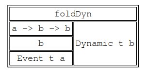
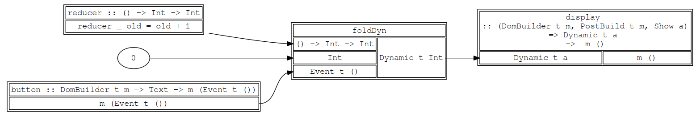
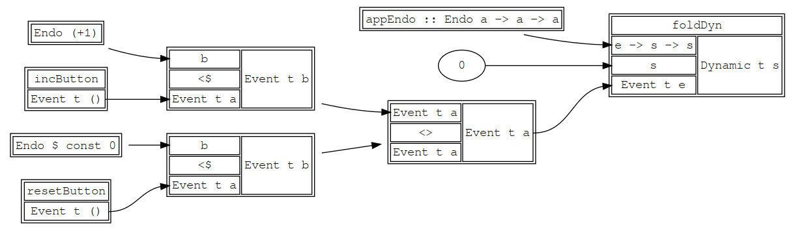

# foldDyn

This recaps the basic reflex DOM example that I talked about in the talk. There is no actual exercise to do here and you may just need to skim this if it is all fairly comfy. If you haven't done any reflex before, it is a good idea to read this carefully or come back to it if the exercises don't make sense.

Learning outcomes:
- Get a basic feel for events and dynamics
- Get a feel for foldDyn being a flux reducer
- Get a feel for EventWriter being analogous to a dispatcher
- Revise mtl style haskell before things ramp up. :)

## Counting Events with FoldDyn

This example is just in the workshop and not in the example. See http://localhost:8001/warmup and [Warmup.hs](../frontend/src/Frontend/Warmup.hs).

In `reflex-dom`, a button returns an event that will fire when the button is clicked:

```haskell
button :: DomBuilder t m => Text -> m (Event t ())
```

Events are the driving force of reflex. In fact, the only time something happens in reflex is from a external event (click, callback) that kicks off a new frame. That event pokes its way into the network and things react to it.

Aside from `performEvent`, which allows us to run some external effect as a reaction to an event we have, the main building block for reacting to an event is `foldDyn`.

```haskell
foldDyn
  :: ( Reflex t        -- ignore this for now
     , MonadHold t m   -- MonadHold allows the m that we are working in to hold some state between frames
     , MonadFix m      -- MonadFix allows for the building of cyclical FP grapss
     )
   => (a -> b -> b)    -- Reducer function. Takes the event value, the old state and returns the new state
   -> b                -- The initial state
   -> Event t a        -- The event. Each time this event fires, it'll rerun the 'reducer'
   -> m (Dynamic t b)  -- This dynamic holds the accumulated state.
```

We can think of an event as something only having a value at discrete points in time (i.e: when it 'fires'). Whereas a dynamic models a variable that always has a value that varies over time. For `foldDyn`, we see this with it starting at a initial value and then getting updated with the reducer every time the input event fires into the reducer.

All your state in your program will be stored in dynamics. The power of reflex is creating a network of dynamics and events so that
the state held in each dynamic is automatically updated when events take place.

There are some definite things that we are glossing over at this point. But that's OK. Lets look at this like a graph so that we can build up an intuition good enough for the workshop.



If we want to connect a button to `foldDyn` to count how many times the button has been pressed, we want something
that looks like this graph:



```haskell
warmup1 :: ( DomBuilder t m, MonadHold t m, MonadFix m, PostBuild t m) => m ()
warmup1 = el "div" $ do
  bClickE  <- button "Click Me"
  countDyn <- foldDyn (\_ old -> old + 1) (0 :: Int) bClickE
  text " "
  display countDyn
```

This shows the `DomBuilder` typeclass from `reflex-dom`, which is critical to building our UI. We build a button, then collect the time varying state from capturing the clicks with `foldDyn`. Then we display a text node and a dynamic text node that uses a show instance to display the value (i.e display).

In this case we are lucky because we can build the dom in the same order as wiring up the FRP parts. If we have cycles or need a different ordering, there's something slightly different that we will see later.

## Composing Events with a Semigroup

But what happens if we want to have more than one event feeding into our `foldDyn`? Say if we wanted to add a reset button that resets the counter to zero as well as the increment button?

Each button returns an event which fires when it is clicked.
We need to combine these two events together so that we get an event which fires when either button is clicked and also
returns the action which should be executed based on the button. If our state is a simple `Int` then the
event should return the `(+1)` function when the increment button is clicked and `const 0` when the reset button is pressed.

```
let addE, resetE :: Event t (Int -> Int)
    addE     = (+1)      <$ addClickE
    resetE   = (const 0) <$ resetClickE
```

Now `addE` and `resetE` have to be combined into a single event. The easiest way to combine together two
events is by using the semigroup instance for `Event`. Two events are combined together using the `(<>)` operator.

```
instance Semigroup a => Semigroup (Event t a) where
  ...
```

This instance requires that the payload for the event is also an instance of semigroup, as the instance works by combining together the
two events if they happen at the same time. Functions of type `a -> b` do not form a `Semigroup` but functions of type `a -> a` do. This
fact is witnessed by the newtype wrapper `Endo a` which provides a `Semigroup` instance for functions of type `a -> a`.

```
> import Data.Monoid.Endo
> let idEndo  = mempty :: Endo Int
> let incEndo = Endo $ (+ (1::Int))
> appEndo idEndo 5
5
> appEndo incEndo 5
6
> appEndo (fold [incEndo, incEndo]) 5
7
```

With the powers of `Endo` and `(`<>)`, we can implement the following.

```haskell
  addClickE   <- button "Click me"
  resetClickE <- button "Reset me"

  let addE     = Endo (+1)      <$ addClickE
  let resetE   = Endo (const 0) <$ resetClickE
  let updatesE = addE <> resetE :: Event t (Endo Int)

  clickCountDyn <- foldDyn appEndo 0 updatesE
  text " "
  display clickCountDyn
```

Note that (<$) just throws away whatever was in the event and replaces it with the thing on the left, turning out Event t () into a Event t (Endo Int).

In graphical form, this looks like:



### More ways to combine events

Using `(<>)` is convenient but when the action is not commutative the result may be unexpected.
If two events combined together using `(<>)` fire at the same time then their results are combined together as well.
For our example, depending on the order the

```
const 0 . (+ 1) != (+1) . const 0
```

We might instead want to prioritise a certain event in the case that many fire at once. In this example, prioritising the reset button makes sense.
The `leftmost` combinator allows us to order the events by priority in the case that multiple events fire at the same time.

```
  let addE     = (+1)      <$ addClickE
  let resetE   = (const 0) <$ resetClickE
  let updatesE = leftmost [resetE, addE] Event t (Int -> Int)
```

## MTL Style Dispatch and Subscription

A lot of the power of redux comes from not having to bubble up event dispatching all the way to the parent state and then not having to explicitly wire state back down the tree. In reflex we have `EventWriter` for dispatch and `MonadReader` for implicitly passing state down. By using the mtl style of programming some really wonderful properties start to emerge.

Lets take our previous example of a counter and refactor it into two components, `resetButton` and `incButton`.

We are perfectly able to make them have type signatures like:
```haskell
resetButton :: (DomBuilder t m) => m (Event t (Endo t m))
incButton :: (DomBuilder t m) => m (Event t (Endo t m))
```

but then all of the parent widgets would need to manually wire those events up to a `foldDyn`, which is fairly laborious, especially if adding a new feature deep into a tree and for refactoring. It is advisable to instead abstract over the capabilities required for each button using class constraints.
In our example, we can rewrite the type signatures to `addButton` and `resetButton` like this:

``` haskell
addButton :: (DomBuilder t m, EventWriter t (Endo Int) m) => m ()
addButton = do
  addClickE   <- button "Click me"
  tellEvent $ Endo (+1) <$ addClickE

resetButton :: (DomBuilder t m, EventWriter t (Endo Int) m) => m ()
resetButton = do
  resetClickE <- button "Reset me"
  tellEvent $ Endo (const 0) <$ resetClickE
```

Both `addButton` and `resetButton` can dispatch events, which is why they have an `EventWriter` constraint. Neither of them needs any state, so there are no `MonadReader` constraints.

If you aren't used to mtl style programming, this can be a little daunting. We have some monadic computational context `m` that can both build dom and dispatch events of type `Endo Int`. This sub components don't have any idea of the concrete type, so that is up to the caller to decide to pick a context that can satisfy all of the constraints of the children.

In order to get hold of the event produced by the buttons you can use `runEventWriterT`:

```haskell
  (_,updatesE) <- runEventWriterT $ do -- Because we call runEventWriterT here, this do block has the
    addButton1                         -- type EventWriterT t (Endo Int) m a
    resetButton1                       -- so the result is m ((),Event t (Endo t Int))

  clickCountDyn <- foldDyn appEndo 0 updatesE
  text " "
  display clickCountDyn
```

Now lets say if we want to change the reset button so that it is disabled if the count is 0. We can add a `MonadReader` constraint to the `resetButton` widget so that it can subscribe to changes in the count.

```haskell
resetButton2
  :: ( DomBuilder t m
     , EventWriter t (Endo Int) m
     , MonadReader (Dynamic t Int) m
     , PostBuild t m)
  => m ()
resetButton = do
  clickCountDyn <- ask                                    -- The type of this is m (Dynamic t Int)
  let disabledDyn = (== 0) <$> clickCountDyn              -- We map over it to turn it to a boolean
  resetClickE <- buttonDynDisabled disabledDyn "Reset me" -- And we pass that disabled dynamic into a sub widget
  tellEvent $ Endo (const 0) <$ resetClickE               -- And do our usual tellEvent
```

The coolest thing about this is that `addButton` doesn't need to change because it only depends on the constraints that it needs rather than a concrete type. This makes our widgets much more modular.

We wire this up in a recursive do block so that we can feed the dynamic that we create later into the running of the `ReaderT`.

### Sidebar: RecursiveDo / rec / mdo / MonadFix

```haskell
  rec (_,updatesE) <- -- Rec allows us to reference clickCountDyn when running the reader
        flip runReaderT clickCountDyn
        . runEventWriterT
        $ do             -- Because we call runEventWriterT and runReaderT here, this do block has the
          addButton      -- type ReaderT (Dynamic t Int) (EventWriterT t (Endo Int) m) a
          resetButton2   -- so the result after the runs is m ((),Event t (Endo t Int))
      clickCountDyn <- foldDyn appEndo 0 updatesE
  text " "
  display clickCountDyn
```

The the variables that are defined in the rec can have cycles, but are still defined at the same level as the display. It's good to keep the rec blocks as small as is possible so that causality loops (FRP infinite loops) are easier to spot and fix.

Using rec or mdo forces that context to have `MonadFix` (the abstraction used to tie the knot in the cycle). Documenation about the syntax can be found [on the haskell wiki](https://wiki.haskell.org/MonadFix).

### Building DOM elements

There are a number of different ways to build elements in `reflex-dom`. The second most general way is:

```haskell
elDynAttr'
  :: (DomBuilder t m, PostBuild t m) =>
     Text                                                  -- ElementName
     -> Dynamic t (Data.Map.Internal.Map Text Text)        -- Dynamic t Map for all attributes
     -> m a                                                -- Child element builder
     -> m (Element EventResult (DomBuilderSpace m) t, a)   -- Returns the dom elt and the result of the builder
```

See the [`reflex-dom` Quickref](../docs/ReflexDomQuickref.md) for more info. Some common functions you might want to use are

* `el` - A static DOM element
* `elClass` - A static DOM element with a class
* `elDynClass` - A DOM element where the class is based on a Dynamic
* `elDynAttr` - A DOM element where the attributes are based on a Dynamic

In order to make a button which takes a `Dynamic t Bool` that is used to mark the button as disabled, then you'd do the following to translate the `Bool` to a map where disabled is present if the dynamic is true:

```haskell
buttonDynDisabled
  :: (DomBuilder t m, PostBuild t m)
  => Dynamic t Bool
  -> Text
  -> m (Event t ())
buttonDynDisabled disabledDyn dt = do
  (buttElt,_) <- elDynAttr' "button"
    (bool Map.empty ("disabled" =: "") <$> disabledDyn)
    (text dt)
  pure $ domEvent Click buttElt
```

## Next Page

[02-login](./02-login.md)
